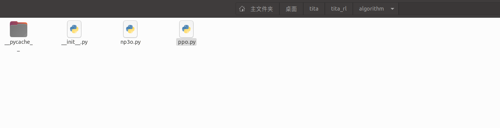
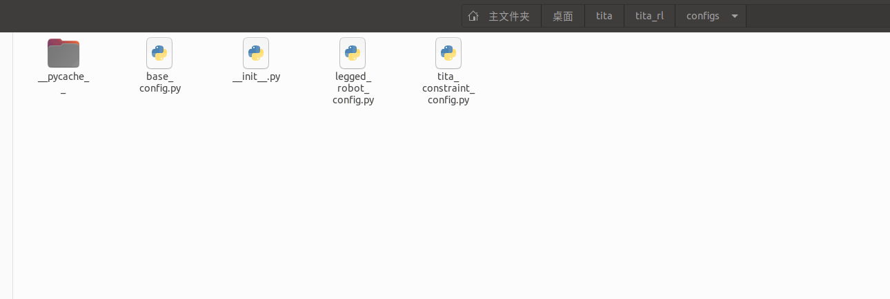

# tita_learning


## 启动conda 虚拟环境

```
conda activate tita2
```

## 进入正确路径


```
cd ~/桌面/tita/tita_rl
```

## 训练

```
python train.py --task=tita_constraint --headless
```

你并不需要可视化

## 转化pt文件为onnx格式
实在没怎么搞懂他官方的那个export文件怎么用 遂自己整了一个

```
python export_direct.py \
>     --pt_path model_11700.pt \
>     --actor_class ActorCriticBarlowTwins \
>     --obs_size 586 \
>     --priv_obs_size 67 \
>     --action_size 8 \
>     --num_priv_latent 36 \
>     --num_hist 10 \
>     --num_prop 33 \
>     --num_scan 187 \
>     --activation elu
```


## 进入docker容器

这个挂载的路径是webots那个上级路径
```
sudo docker run -v ~/桌面/tita:/mnt/dev -w /mnt/dev --rm  --gpus all --net=host --privileged -e DISPLAY=$DISPLAY -e QT_X11_NO_MITSHM=1  -e CUDA_TOOLKIT_ROOT_DIR=/usr/local/cuda -it registry.cn-guangzhou.aliyuncs.com/ddt_robot/ubuntu:webot2023b-v1
```


## 将onnx转为.engine
到onnx下的路径

```
/usr/src/tensorrt/bin/trtexec --onnx=policy.onnx --saveEngine=model_gn.engine
```


## 启动webots(在此之前记得依据官方文档修改engine路径)
在容器外运行
```
xhost +local:root  # 允许本地 root 用户（容器内默认是 root）访问 X11
```
然后进入应该有的目录 启动webots

```
cd tita_rl_sim2sim2real


sudo mkdir -p /usr/share/robot_description

sudo cp -r src/tita_locomotion/tita_description/tita /usr/share/robot_description/

source /opt/ros/humble/setup.bash && source install/setup.bash && ros2 launch locomotion_bringup sim_bringup.launch.py

```


## 方向盘


```
docker exec -it amazing_booth /bin/bash #从另外一个终端进入 这个‘amazing booth’

cd tita_rl_sim2sim2real

source /opt/ros/humble/setup.bash && source install/setup.bash && ros2 run keyboard_controller keyboard_controller_node --ros-args -r __ns:=/tita
```
## 文件整理


### algorithm（PPO）





#### 代码解释

```


```

PPO 的数学核心在于通过代理目标函数 $L^{\text{CLIP}}$ 优化策略，结合 GAE 估计优势函数、剪辑的价值损失和熵正则化来平衡稳定性与探索性。代码中的实现严格遵循这些数学原理，通过 actor_critic 模块、经验存储和优化步骤，将理论转化为实践。PPO 的剪辑机制和自适应调整使其成为一种高效且稳定的强化学习算法，广泛应用于复杂任务中。

GAE 综合了多步回报的估计，平衡了单步 TD(0)（低方差但高偏差）和蒙特卡洛方法（高方差但低偏差）。


### algorithm(np3o)
NP3O（基于 PPO 的扩展算法）

NP3O 扩展 PPO，新增成本约束（$L^{\text{CLIP}}_c, L^{\text{viol}}$）、模仿学习（$L^{\text{IMI}}$）和深度演员（$L^{\text{DA}}$），通过 GAE、剪辑损失和自适应学习率保持稳定性。代码精确实现这些数学公式，平衡奖励最大化与成本约束，同时支持模仿学习增强策略优化。

### pycache

__pycache__ 文件夹是 Python 在编译源代码文件（.py）时自动生成的，用于存储字节码文件（.pyc），以加速模块加载。以下是其内容的数学与技术分析，保持简练：


### config



### basic config
递归过程 $ \text{init\_member\_classes} $ 遍历这棵树，实例化每个类节点，形如：
$$\text{Tree}(O) = \{ O \} \cup \{ \text{Tree}(v') \mid v = \text{getattr}(O, \text{key}), \text{isclass}(v), v' = v() \}.$$

类节点是树的中间节点，连接对象和其嵌套结构。

### legged_robot_config


LeggedRobotCfg 和 LeggedRobotCfgPPO 通过树状参数结构（经 BaseConfig 递归实例化）定义了足式机器人环境和 NP3O 算法的配置。数学上，它们指定了状态空间 $\mathcal{S} \in \mathbb{R}^{673}$, 动作空间 $\mathcal{A} \in \mathbb{R}^8$, 奖励函数 $ R_t $, 成本约束 $ C_i \leq d_i $, 以及神经网络和优化参数。代码与 NP3O 算法紧密耦合，支持复杂的机器人强化学习任务，平衡奖励最大化、成本约束和模仿学习。

2.1 env 类

num_envs = 4096：

来源：并行环境数量通常基于硬件能力（如 GPU 并行计算）和算法效率。4096 是 2 的幂，便于批量处理（如在 GPU 上并行采样）。
数学意义：批量大小 $B = \text{num\_envs} \cdot \text{num\_steps\_per\_env} = 4096 \cdot 24 = 98304$，增大批量降低梯度估计方差 $\text{Var}(\nabla_\theta J)$.


num_observations = n_proprio + n_scan + history_len * n_proprio + n_priv_latent = 46 + 132 + 10 * 46 + 35 = 673：

来源：

n_proprio = 46：本体感知（proprioception）数据，如关节角度、速度，具体维度由机器人模型（8 个关节的控制信号及其他状态）决定。
n_scan = 132：扫描数据（如激光雷达或深度传感器），可能来自地形高度测量点（measured_points_x * measured_points_y = 17 * 11 = 187 的子集或压缩）。
history_len = 10：历史观察长度，基于任务复杂度（动态环境需要更长历史来近似马尔可夫性）。
n_priv_latent = 4 + 1 + 12 + 12 + 6 = 35：特权信息（如环境摩擦系数、机器人质量），用于不对称演员-评论家训练。


数学意义：观察空间 $\mathcal{S} \in \mathbb{R}^{673}$，高维状态需要神经网络（如 policy.actor_hidden_dims）进行特征提取。


num_actions = 8：

来源：由机器人关节数决定（例如，4 条腿每条 2 个自由度）。动作通常是关节角度或扭矩。
数学意义：动作空间 $\mathcal{A} \in \mathbb{R}^8$, 策略 $\pi_\theta(a|s) \sim \mathcal{N}(\mu_\theta(s), \sigma_\theta(s))$.


episode_length_s = 20：

来源：基于任务需求（如机器人行走一个完整周期的时间），结合仿真时间步 sim.dt = 0.0025 秒，转换为步数 $ 20 / 0.0025 = 8000 $.
数学意义：定义了轨迹长度，影响回报 $R = \sum_{t=0}^{T} \gamma^t r_t$, $T \approx 8000$.


2.2 cost 类

num_costs = 1：

来源：单一成本类型可能表示单一约束（如碰撞次数或能量消耗），由任务需求简化而定。
数学意义：定义成本函数 $c_t: \mathcal{S} \times \mathcal{A} \to \mathbb{R}$ , NP3O 优化 $C(\pi) = \mathbb{E} \left[ \sum_t \gamma^t c_t \right] \leq d$.


3. 输出分析
3.1 直接输出

实例化的参数对象：通过 BaseConfig.__init__，所有嵌套类（如 env, policy）被实例化，生成一个可访问的对象树。

示例：
pythoncfg = LeggedRobotCfg()
 输出：cfg.env.num_envs == 4096, cfg.env.num_observations == 673
cfg_ppo = LeggedRobotCfgPPO()
 输出：cfg_ppo.policy.actor_hidden_dims == [512, 256, 128]


结构：

LeggedRobotCfg：包含环境参数（如 env, terrain, rewards）。
LeggedRobotCfgPPO：包含算法和策略参数（如 policy, algorithm, runner）。


### tita_env_constraint

TitaConstraintRoughCfg 和 TitaConstraintRoughCfgPPO 代码解释
此代码定义了 TitaConstraintRoughCfg 和 TitaConstraintRoughCfgPPO 类，专为 Tita 机器人（一种足式机器人模型，由 ETH Zurich 的 Nikita Rudin 等研究者开发或使用，基于 URDF 描述，可能为简化版四足机器人，用于强化学习实验）定制配置。Tita 可能基于 ANYmal 或类似项目，聚焦敏捷移动（如 parkour）和约束优化。
代码继承自之前讨论的 LeggedRobotCfg 和 LeggedRobotCfgPPO（基类），通过覆盖（override）特定参数来适应 Tita 的形态、动态和约束需求。继承关系确保兼容 NP3O/PPO 框架，但调整了参数以匹配 Tita 的 URDF 模型（简化关节结构）和实验设置（如减少环境数以加速训练）。以下从输入输出、数学角度和与基类的关系详细解释。

1. 代码功能与上下文

功能：这些类扩展基类，提供 Tita 专属配置，用于 NP3O 算法的约束强化学习（constraint-based RL）。Tita 强调快速学习（如分钟级行走）和地形适应（如粗糙地形），代码中加入多成本约束（num_costs=6）和 Barlow Twins 编码（ActorCriticBarlowTwins），用于自监督特征学习。


与基类的关系：

继承：TitaConstraintRoughCfg 继承 LeggedRobotCfg，覆盖 env, init_state, control, commands, asset, rewards, domain_rand, depth, costs, cost, terrain 等子类参数，保留基类默认（如 terrain.mesh_type='trimesh'）。

覆盖目的：适应 Tita 的具体硬件（如 8 个关节 vs. 基类的通用设置）和实验（如减少 num_envs 以降低计算负载，增加约束损失系数以强化安全）。

PPO 部分：TitaConstraintRoughCfgPPO 继承 LeggedRobotCfgPPO，覆盖 algorithm, policy, runner，添加 Tita 特定功能如教师动作模仿（teacher_act=True, imi_flag=True）和 Barlow Twins 演员-评论家（ActorCriticBarlowTwins）。


整体：基类是通用模板，这个是子类特化，类似于数学中的函数覆盖：基函数 $f(x)$，子函数 $f'(x) = f(x) + \Delta(x)$，其中 $\Delta(x)$ 是 Tita 调整。

TitaConstraintRoughCfg 和 TitaConstraintRoughCfgPPO 是基类 LeggedRobotCfg 和 LeggedRobotCfgPPO 的子类扩展，针对 Tita 机器人覆盖参数，以适应其 URDF、简化关节（8 个）和约束优化需求。输入输出机制相同（无输入，输出实例化树），但数学上扩展了多成本约束和自监督学习，支持 NP3O 在 Tita 上的高效训练。差异聚焦于计算优化、约束强化和模仿学习，继承基类确保兼容性。


#总体策略


### Tita 机器人的 NP3O 训练策略详解

Tita 机器人（基于代码中的 URDF 文件 `{ROOT_DIR}/resources/tita/urdf/tita_description.urdf`）是一个足式机器人模型，由 ETH Zurich 的 Nikita Rudin 等研究者开发或使用，可能为 ANYmal 或类似四足机器人的简化变体，专为敏捷移动（如粗糙地形行走、跳跃）和快速学习设计。Tita 的训练策略基于 NP3O（Near Proximal Policy Optimization with Constraints），一种扩展 PPO 的算法，强调约束优化（如位置/扭矩极限）和模仿学习（`imi_flag=True`），以实现分钟级学习（如从随机初始化到稳定行走）。代码中，NP3O 通过罚函数处理 6 种成本约束（`num_costs=6`），结合域随机化（`domain_rand`）和自监督编码（`ActorCriticBarlowTwins`），在模拟环境中（如 Isaac Gym）训练策略$\pi_\theta(a|s) \sim \mathcal{N}(\mu_\theta(s)$, $\sigma_\theta(s)$。

训练目标：最大化期望回报 $J(\pi) = \mathbb{E} \left[ \sum_t \gamma^t r_t \right]$ \)$ $gamma=0.99$，**同时满足多约束** $C_i(\pi) \leq d_i$（如扭矩不超过阈值）。过程是一个循环：采样 → 计算 → 更新，迭代 `max_iterations=30000` 次，每迭代采样批量 \( B = 2048 \times 24 = 49152 \) 样本（`num_envs=2048`, `num_steps_per_env=24`）。以下是详细步骤，结合代码和数学逻辑。

#### 步骤 1: 初始化（Setup Phase）
- **目标**：设置 Tita 的环境、策略和优化器，加载预训练以加速收敛（分钟级学习的关键）。
- **详细操作**：
  1. **配置实例化**：创建 `TitaConstraintRoughCfg` 和 `TitaConstraintRoughCfgPPO` 对象。递归初始化参数树（继承 `BaseConfig`），定义状态空间 \(\mathcal{S} \in \mathbb{R}^{885}\)（`num_observations = 33 + 187 + 10 \times 33 + 35`：本体感、扫描、历史、特权信息）和动作空间 \(\mathcal{A} \in \mathbb{R}^8\)（8 个关节，从 `default_joint_angles` 推断）。
  2. **环境初始化**：使用 Isaac Gym 创建 2048 个并行环境（`num_envs=2048`），加载 Tita URDF（`asset.file`），设置初始状态（如 `pos=[0.0,0.0,0.3]`，低重心适应粗糙地形）。应用域随机化：摩擦 $\mu \sim [0.2, 2.75]$、质量增量 \([-1,3]\)、干扰 \([-30,30]\)（每 8 步间隔），增强鲁棒性 $\mathbb{E}_{p \sim \mathcal{U}} [J(\pi; p)]$。
  3. **NP3O 初始化**：实例化 `NP3O` 类，设置 `clip_param=0.2`（剪辑 \(\epsilon\)）、`gamma=0.99`、`lam=0.95`（GAE 参数）、`learning_rate=1e-3`、`max_grad_norm=0.01`（梯度剪辑，防止 Tita 敏感动态爆炸）。启用模仿（`imi_flag=True`），加载教师模型。
  4. **网络初始化**：使用 `ActorCriticBarlowTwins`（隐藏层 `[512,256,128]`，激活 'elu'），初始化噪声 `init_noise_std=1.0`。添加 Barlow Twins 损失 \( L_{\text{BT}} = \sum_{i,j} (C_{ij} - \delta_{ij})^2 \)（C 是跨视图协方差），鼓励不变特征（如地形适应）。
  5. **恢复检查点**：如果 `resume=True`，从 `'tita_example_10000.pt'` 加载权重，继续训练（继承基类 `resume_path=None`）。
- **数学逻辑**：初始化将约束问题转化为罚函数优化 \( \min_\theta -J(\pi_\theta) + \sum_{i=1}^6 k_i \max(0, C_i(\pi_\theta) - d_i) \)，其中 \( d_i \) 从 `costs.d_values`（如 `torque_limit=0.0`），\( k_i \) 动态增大（`update_k_value`）。
- **Tita 特定**：简化关节（8 个 vs. 基类通用），焦点粗糙地形（`terrain.mesh_type='trimesh'`），分钟级学习依赖大规模并行（2048 envs）和预训练。

#### 步骤 2: 采样轨迹（Rollout Phase）
- **目标**：使用当前策略采样经验，应用 PD 控制（`stiffness=40`, `damping=1.0`）和动作缩放（`action_scale=0.5`）。
- **详细操作**（在 `OnConstraintPolicyRunner` 循环）：
  1. **重置**：调用 `actor_critic.reset(dones)`，设置初始关节（如 `joint_left_leg_2=0.8`）。
  2. **动作生成**：`act(obs, critic_obs, info)` 输出 \( a_t \)，价值 \( V(s_t) \)、成本价值 \( V^c(s_t) \in \mathbb{R}^6 \)、概率 \( \log \pi_\theta(a_t|s_t) \)。如果 `teacher_act=True`，混合教师动作。
  3. **环境步进**：`process_env_step(rewards, costs, dones, infos)`，推进仿真（`decimation=4`, 每政策步 4 个仿真步）。存储奖励（如 `tracking_lin_vel=1.0` 鼓励速度跟踪 \( \exp(-\text{error}^2 / 0.25) \)) 和成本（如 6 种：位置极限、扭矩等）。
  4. **随机化**：应用 `domain_rand`（电机强度 `[0.8,1.2]`、KP/KD `[0.8,1.2]`、延迟 3 步），模拟真实不确定性。
  5. **重复**：24 步/环境，填充 `RolloutStorageWithCost`。
- **数学逻辑**：on-policy 采样轨迹 \(\tau \sim \pi_\theta\)，用于代理目标 \( L^{\text{CLIP}} = \mathbb{E} [\min(r_t A_t, \text{clip}(r_t, 1-0.2, 1+0.2) A_t)] \)，\( r_t = \pi_\theta(a|s)/\pi_{\text{old}}(a|s) \)。
- **Tita 特定**：低重心（`base_height_target=0.35`）和脚部碰撞惩罚（`penalize_contacts_on=["leg_3"]`）适应粗糙地形；功率惩罚 `powers=-2e-5` 优化能量效率。

#### 步骤 3: 计算回报与优势（Compute Phase）
- **目标**：估计回报和优势，处理约束违反。
- **详细操作**：
  1. `compute_returns(last_critic_obs)`：计算奖励回报 \( R_t = \sum_k \gamma^k r_{t+k} + \gamma^T V(s_T) \)。
  2. `compute_cost_returns(obs)`：类似计算成本回报 \( C_{i,t} \)。
  3. 计算优势：GAE \( A_t = \sum_l (\gamma \lambda)^l \delta_{t+l} \)，\(\delta_t = r_t + \gamma V(s_{t+1}) - V(s_t)\)；成本优势 \( A^c_{i,t} \)。
  4. 计算违反：`compute_viol`，\( v_i = \max(0, \bar{C}_i - d_i) \)，罚因子 \( k_i \) 增大（1.0004^i）。
- **数学逻辑**：GAE 平衡偏差/方差（\(\lambda=0.95\) 偏多步），确保约束罚函数渐进收敛 \( L^{\text{viol}} \to 0 \)。
- **Tita 特定**：6 种成本（如 `acc_smoothness=0.1`, 惩罚加速度抖动）防止 Tita 在粗糙地形翻倒。

#### 步骤 4: 策略更新（Update Phase）
- **目标**：最小化总损失，更新 \(\theta\)。
- **详细操作**（`update` 方法）：
  1. 生成小批量：分成 4 批（`num_mini_batches=4`），每批 5 轮（`num_learning_epochs=5`）。
  2. 前向：`actor_critic.act/evaluate/evaluate_cost`，计算新概率、价值、熵。
  3. 代理损失：`compute_surrogate_loss`（奖励）、`compute_cost_surrogate_loss`（成本）。
  4. 价值损失：`compute_value_loss`（奖励系数 1.0，成本 0.1）。
  5. 违反损失：`compute_viol`（系数 0.1）。
  6. 模仿/Barlow Twins：添加 \( L^{\text{IMI}} \)（学生 vs. 教师）和 \( L_{\text{BT}} \)。
  7. 自适应 KL：调整学习率（目标 0.01）。
  8. 优化：总 \( L \) 反向传播，梯度剪辑 0.01，Adam 更新。
  9. 清空存储，记录损失（`mean_viol_loss` 等）。
- **数学逻辑**：P3O 通过罚函数等价约束迭代，证明有限步内约束满足；熵项 `-0.01 L^{\text{ENT}}` 鼓励探索。
- **Tita 特定**：小梯度规范（0.01）适应 Tita 精细控制；模仿加速分钟级学习。

#### 步骤 5: 评估与迭代（Evaluation Loop）
- 每 100 迭代保存模型，监控违反率和回报。终止条件：迭代 30000 或约束满足。
- **Tita 特定**：焦点地形适应（扫描 187 点）和约束（如脚接触力 `feet_contact_forces=0.1`），实现敏捷行为。

### 实践建议
- **运行**：在 GPU 上设置 Isaac Gym，运行 `OnConstraintPolicyRunner`，从检查点恢复以分钟级收敛。
- **调优**：如果违反高，增大 `cost_viol_loss_coef`；监控 `mean_imitation_loss` 以确保模仿有效。
- **扩展**：针对真实 Tita，添加 sim-to-real 桥接（如更多噪声）。

此策略确保 Tita 在约束下安全学习，数学上平衡探索、安全和效率。


### Barlow Twins 和 Adam 更新解释
以下从数学和技术的角度，简练分析 Barlow Twins 和 Adam 更新，结合 TitaConstraintRoughCfg 和 TitaConstraintRoughCfgPPO 代码（基于 NP3O 强化学习框架）的上下文，特别是 Tita 机器人的训练策略。

1. Barlow Twins 解释

1.1 定义与作用
Barlow Twins 是一种自监督学习方法，用于学习表示（representation learning），通过最小化视图间的冗余（redundancy）来提取鲁棒特征。代码中，ActorCriticBarlowTwins 表明 Tita 的演员-评论家网络（actor_hidden_dims=[512,256,128]）集成了 Barlow Twins 损失，用于增强观察编码（如地形扫描 n_scan=187 或深度数据 depth.resized=(87,58)）的鲁棒性，适合复杂地形适应。


1. Adam 更新解释

2.1 定义与作用
Adam（Adaptive Moment Estimation）是一种自适应梯度下降优化器，广泛用于深度学习和强化学习（如 NP3O）。它结合动量法和 RMSProp，高效更新神经网络参数（如 Tita 的 ActorCriticBarlowTwins 参数 $\theta$），以最小化总损失 $ L $。代码中，Adam 用于优化策略和价值函数，学习率 learning_rate=1e-3，梯度剪辑 max_grad_norm=0.01。

4. 总结

Barlow Twins：在 Tita 训练中，通过 $ L_{\text{BT}} $ 增强观察编码的鲁棒性，适合复杂地形（如 terrain.mesh_type='trimesh'），结合模仿学习（imi_flag=True）支持分钟级收敛。
Adam 更新：通过自适应梯度（learning_rate=1e-3）和剪辑（max_grad_norm=0.01）优化 NP3O 损失 $ L $，确保 Tita 在粗糙地形下的稳定性和约束满足。
实践建议：运行训练时，监控 mean_imitation_loss 和 mean_viol_loss，调整 $\lambda$（Barlow Twins 权重）或增大 cost_viol_loss_coef=0.1 以强化约束。使用预训练检查点（resume_path）加速 Tita 的分钟级学习。